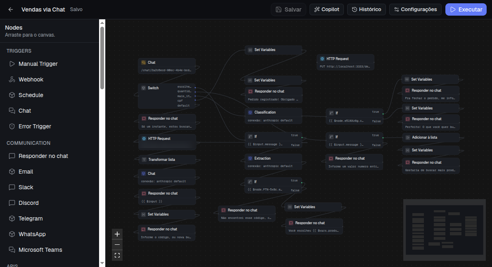
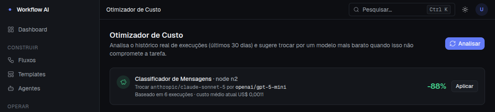
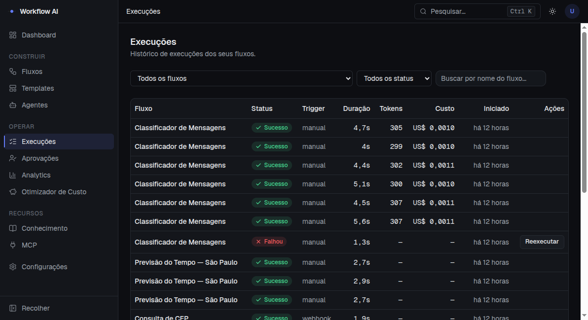
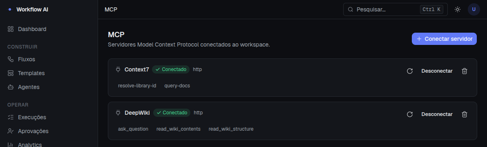

<h1 align="center">Workflow AI Platform</h1>

<p align="center">
  Plataforma <strong>AI-first</strong> para criação de automações inteligentes —
  workflows visuais, agentes, RAG, MCP e integrações.<br>
  Multi-tenant, orientada a eventos, em produção.
</p>

<p align="center">
  <a href="https://github.com/jeanprocha/ai-workflow/actions/workflows/ci.yml">
    </a>
  
  
  
  
  
</p>

<p align="center">
  
  <br><sub><b>Editor de workflows</b> — triggers, nodes de IA (classificação, extração), condições, integrações HTTP e canais de resposta</sub>
</p>

<p align="center">
  
  <br><sub><b>Otimizador de custo</b> — analisa o histórico real de execuções e sugere trocar de modelo quando isso não compromete a tarefa. Multi-provider, com aplicação em um clique</sub>
</p>

<p align="center">
  
  <br><sub><b>Execuções</b> — cada run com duração, <b>tokens consumidos e custo em dólar</b>, e reexecução das que falharam</sub>
</p>

<p align="center">
  
  <br><sub><b>MCP</b> — servidores Model Context Protocol conectados ao workspace, com as tools descobertas e disponíveis para os agentes</sub>
</p>

## Para quem vai ler o código

| | |
|---|---|
| **Tamanho** | ~62.000 linhas de TypeScript em 814 arquivos (monorepo Turborepo) |
| **Testes** | 71 suítes — unit (Jest/Vitest) e E2E (Playwright) no CI |
| **Apps** | `web` (Next.js) · `api` (NestJS, dois entrypoints: HTTP e worker de filas) |
| **Dados** | PostgreSQL (Prisma) · pgvector para RAG · Redis para filas |
| **Deploy** | Railway (API + worker) · Vercel (web) |
| **Observabilidade de IA** | Tokens e custo em dólar por execução, com otimizador de custo |

O que faz este projeto valer a leitura não é o tamanho — são as **decisões
registradas**. Cada escolha estrutural tem um ADR com contexto, alternativas
consideradas e consequências assumidas, em [docs/adr/](docs/adr/):

- **[ADR-011 — Pausa durável](docs/adr/011-pausa-duravel.md)**: como um fluxo para no
  meio da execução, espera uma aprovação humana por horas ou dias e retoma exatamente
  de onde parou — num engine cujo estado vivia todo em memória, com nodes isolados em
  `worker_thread` e um recovery que mata execuções órfãs. O ADR mais denso do projeto.
- **[ADR-006 — Multi-tenancy desde a fundação](docs/adr/006-multi-tenancy.md)**: por que
  todo recurso nasce escopado por `workspace_id` desde a fase 2 — retrofitar depois
  custa migração de dados e risco de vazamento entre tenants.
- **[ADR-005 — Isolamento de execução](docs/adr/005-isolamento-execucao-nodes.md)**:
  cada node roda num `worker_thread` com timeout duro; o grafo avança em ondas.
- **[ADR-007 — Criptografia de secrets](docs/adr/007-criptografia-secrets.md)** ·
  **[ADR-009 — Saída estruturada de LLM](docs/adr/009-saida-estruturada-llm.md)** ·
  **[ADR-010 — Observabilidade](docs/adr/010-observabilidade.md)** — e os demais no
  [índice](docs/adr/).

Além dos ADRs, o estado de cada domínio está documentado em
[docs/sistema/](docs/sistema/00-visao-geral.md) — um doc por área (engine, versionamento
de workflows, aprovação humana, triggers e scheduler, agents, RAG, MCP, auth,
observabilidade…).

### Sobre o processo

Construído com **desenvolvimento assistido por IA**, declarado de propósito. A
ferramenta acelera a escrita; as decisões — o que os ADRs registram, com alternativas
descartadas e trade-offs assumidos — são o trabalho de engenharia. Quem quiser conferir
se elas se sustentam tem 11 documentos por onde começar.

**A documentação completa começa em [docs/README.md](docs/README.md)** — de lá saem o estado atual do sistema (um doc por domínio em [docs/sistema/](docs/sistema/00-visao-geral.md)), as decisões arquiteturais e o histórico de produto.

Os arquivos [spec.md](spec.md), [plan.md](plan.md) e [style.md](style.md) na raiz estão congelados desde 2026-07-23 e são material histórico.

## Setup

Pré-requisitos: Node 20+, pnpm 9+, Docker.

```bash
pnpm install
```

```bash
docker compose -f docker-compose.dev.yml up -d
```

```bash
pnpm dev
```

- Web: http://localhost:3000
- API: http://localhost:3333 (healthcheck em `/health`)

O docker compose sobe Postgres em `5433`, Redis em `6380` e o Mailpit (SMTP de desenvolvimento) em `1025` / `8025`. Em máquinas onde o `apps/web/.env` aponta para um IP de LAN, use esse endereço em vez de `localhost` — ver [CLAUDE.md](CLAUDE.md).

## Banco de dados

O schema Prisma vive em `apps/api/prisma/schema.prisma`. Copie `apps/api/.env.example` para `apps/api/.env` antes de rodar migrations:

```bash
cp apps/api/.env.example apps/api/.env
pnpm --filter @workflow/api prisma:migrate
```

O seed popula o catálogo de templates globais (não cria usuário — a primeira conta sai de `/register`):

```bash
pnpm --filter @workflow/api prisma:seed
```

## Estrutura

```
apps/
  web/       Next.js — frontend
  api/       NestJS — dois entrypoints: API HTTP e worker de filas
             (Dockerfile de produção em apps/api/Dockerfile)
packages/
  shared/    Tipos compartilhados (Workflow, Node, Execution...)
  nodes/     Registry de nodes do workflow engine
  ai/        Abstração de providers de IA + MCP client
  ui/        Design system
docs/sistema/ Estado atual do sistema, um doc por domínio
docs/adr/     Registro de decisões arquiteturais
docs/produto/ Histórico de evolução (planos, discoveries, specs)
docs/deploy/  Deploy em produção (Railway + Vercel)
```

O worker é um processo separado e **não** sobe com `pnpm dev`:

```bash
pnpm --filter @workflow/api dev:worker
```

## Scripts

| Comando          | Descrição                               |
| ---------------- | --------------------------------------- |
| `pnpm dev`       | Roda web + api em modo desenvolvimento  |
| `pnpm build`     | Build de todos os apps/packages         |
| `pnpm lint`      | Lint em todo o monorepo                 |
| `pnpm typecheck` | Typecheck em todo o monorepo            |
| `pnpm test`      | Testes em todo o monorepo               |
| `pnpm test:e2e`  | Suíte Playwright (exige serviços de pé) |
| `pnpm format`    | Formata com Prettier                    |

## Roadmap

Ver [docs/produto/base-evolucao.md](docs/produto/base-evolucao.md) — o documento-mestre de evolução, com os três horizontes H1 (concluído), H2 e H3.
